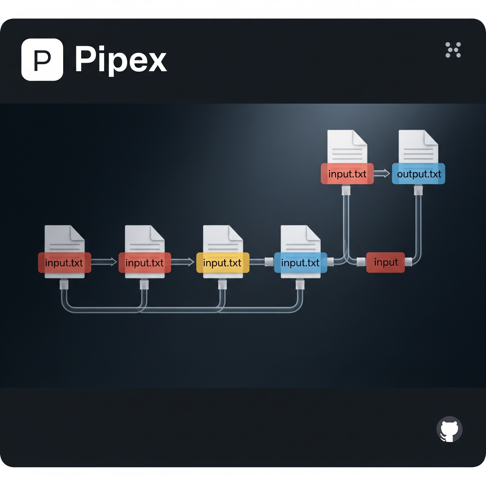

# Pipex

## 📚 Description

**Pipex** is a UNIX-style program that mimics shell piping behavior.  
It takes a file, passes its content through a series of shell commands, and outputs the result to another file.  
This project is part of the 42 school curriculum and helps deeply understand process handling, piping, and file redirection in UNIX.

---

## 🚀 Mandatory Usage

The program must behave **exactly like** this shell command:

```bash
< file1 cmd1 | cmd2 > file2
```

### ✅ Program Execution:
```bash
./pipex file1 cmd1 cmd2 file2
```

#### 🔧 Example:
```bash
./pipex infile "ls -l" "wc -l" outfile
```
# Equivalent to:
```bash
< infile ls -l | wc -l > outfile
```

---

## 🧠 How It Works

1. Reads from `file1`.
2. Executes `cmd1`, pipes its output to `cmd2`.
3. Writes final output to `file2`.

---

## 🛠️ Installation

### 📦 Requirements
- OS: **Linux** or **macOS**
- Compiler: **GCC** with flags `-Wall -Wextra -Werror`
- Language: **C**
- Libraries: MiniLibX, Libft (your own)
- Tools: **Make**, **bash**

### ⚙️ Build

```bash
make
```

To clean:
```bash
make clean       # removes object files
make fclean      # removes object files + executable
make re          # rebuilds everything
```

---

## 📂 Project Structure

```
.
├── src/
│   ├── pipex.c
│   ├── utils.c
│   └── ...
├── src_bonus/
│   ├── pipex_bonus.c
│   ├── utils_bonus.c
│   └── ...
├── include/
│   └── pipex.h
├── lib/
│   └── ... (all libraries that I made earlier like (libft/ft_print-get_next_line)
├── Makefile
└── README.md
```

---

## ⚡ Features

- Handles **input/output file redirection**
- Executes shell **commands** with their parameters
- **Pipes output** from one command to the next
- Mimics shell behavior precisely

---

## ✨ Bonus Part
You can run multiple commands in a chain or use **here_doc**:

### ➕ Multiple Commands (Multiple Pipes)

```bash
./pipex infile "cmd1" "cmd2" "cmd3" "cmd4" outfile
# Equivalent to: < infile cmd1 | cmd2 | cmd3 | cmd4 > outfile
```

### ➕ here_doc Support

```bash
./pipex here_doc LIMITER cmd1 cmd2 outfile
# Equivalent to: cmd1 << LIMITER | cmd2 >> outfile
```

---

## 📌 Norm & Constraints

- Written in **C**, 100% **Norm-compliant**
- No **memory leaks**
- Proper error handling (e.g. missing files, invalid commands)
- No crashes (segfaults, bus errors, etc.)
- Efficient and clean resource management (freeing heap memory)

---
# Get started with the project!
## Cloning the repo
```bash
git clone https://github.com/husaltam/Pipex.git pipex
cd pipex
```

## Compiling / I recomend the bounus program
```bash
make re
make bonus
```

# 🧪 Testing
Make sure you alread have in inuput file called input.txt for the sake of the foloowing tests:
## ✅ BASIC MULTI-COMMAND PIPELINE TESTS

### 1. Simple pipeline
Original shell comand:

```bash
< input.txt grep hello | wc -l > output.txt
```
This should output similar reslut if we run the program this way
```bash
./pipex_bonus input.txt "grep hello" "wc -l" output.txt
```
---

### 2. Quoted strings
Original shell comand:

```bash
< input.txt grep hello | wc -l > output.txt
```
This should output similar reslut if we run the program this way
```bash
./pipex_bonus input.txt "grep hello" "wc -l" output.txt
```

---

## ✅ ADVANCED COMMAND STRUCTURES

### 3. Sort and uniq
Original shell comand:
```bash
< input.txt sort | uniq -c | sort -nr > output.txt
```
This should output similar reslut if we run the program this way
```bash
./pipex_bonus input.txt "sort" "uniq -c" "sort -nr" output.txt

```
### 4. Mixed command options
Original shell comand:
```bash
< input.txt cut -d' ' -f1 | sort | uniq > output.txt
```
This should output similar reslut if we run the program this way
```bash
./pipex_bonus input.txt "cut -d' ' -f1" "sort" "uniq" output.txt

```
---
## ✅ HERE_DOC EDGE CASES
### 5. Basic here_doc
Original shell comand:
```bash
cat <<END | grep foo | wc -l >> output.txt
foo bar
baz foo
not me
END

```
This should output similar reslut if we run the program this way
```bash
./pipex_bonus here_doc END "grep foo" "wc -l" output.txt
foo bar
baz foo
not me
END

```


### 6. Quoted LIMITER (shell vs. program behavior should match)
Original shell comand:
```bash
cat <<END | grep foo | wc -l >> output.txt
foo bar
baz foo
not me
END
```

This should output similar reslut if we run the program this way
```bash
./pipex_bonus here_doc END "grep foo" "wc -l" output.txt
foo bar
baz foo
not me
END
```
---
## ✅ ERROR HANDLING TESTS
### 7. Nonexistent command
Original shell comand:
```bash
< input.txt grep hello | nonexistent_cmd | wc -l > output.txt
```
This should output similar reslut if we run the program this way
```bash
./pipex_bonus input.txt "grep hello" "nonexistent_cmd" "wc -l" output.txt
```

### 8. Invalid file
Original shell comand:
```bash
< no_such_file grep hello | wc -l > output.txt
```
This should output similar reslut if we run the program this way
```bash
./pipex_bonus no_such_file "grep hello" "wc -l" output.txt
```

## ✅ EDGE-CASE QUOTING BEHAVIOR
### 9. Quoted quotes
Original shell comand:
```bash
< input.txt awk '{print "\""$1"\""}' | sed 's/"//g' > output.txt
```
This should output similar reslut if we run the program this way
```bash
./pipex_bonus input.txt "awk '{print \"\\\"\"\$1\"\\\"\"}'" "sed 's/\"//g'" output.txt
```

## 🔐 License

This project is for educational purposes as part of 42 coding school. Do not use in production without permission!


